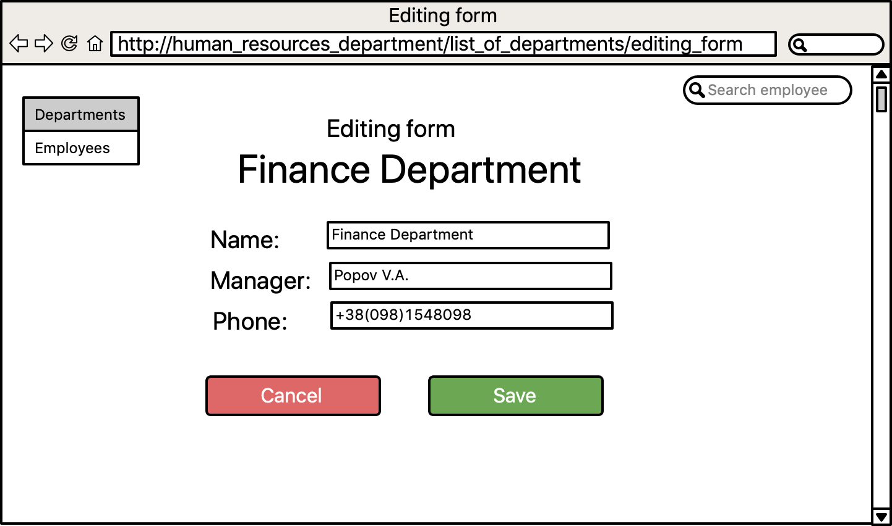
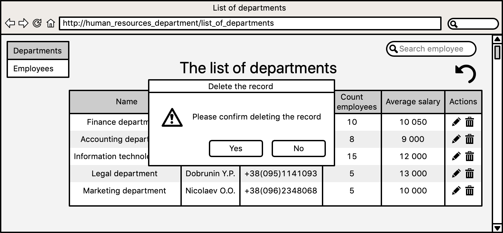
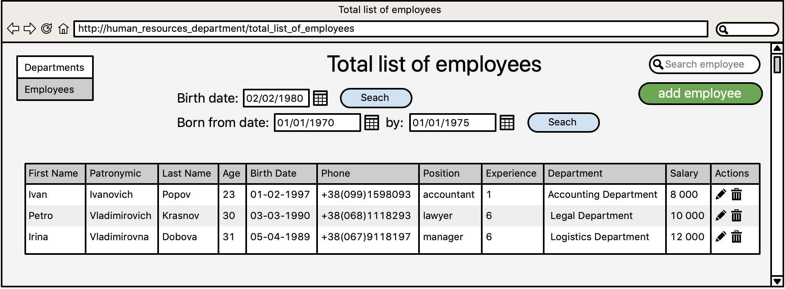
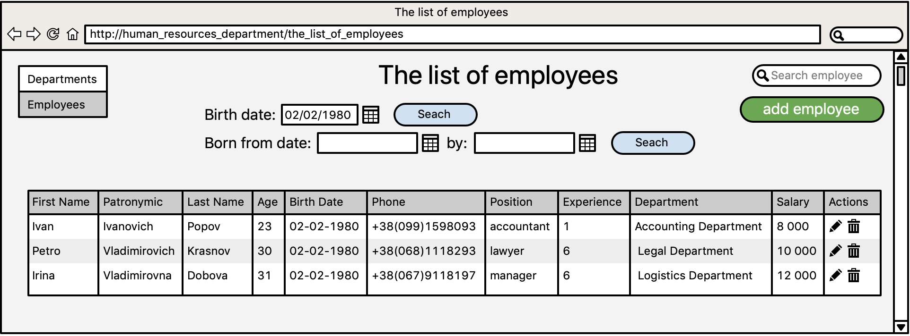
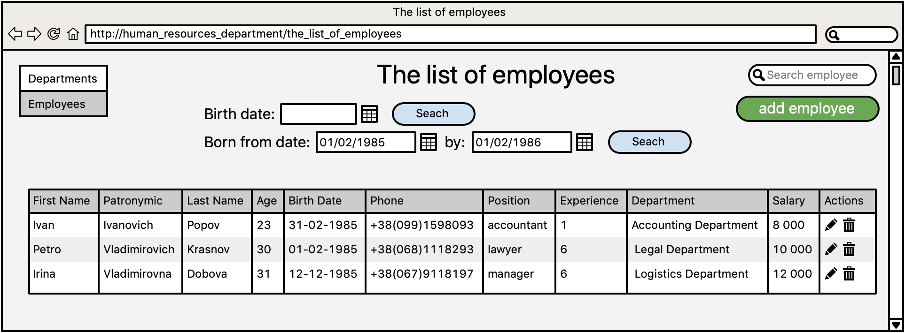
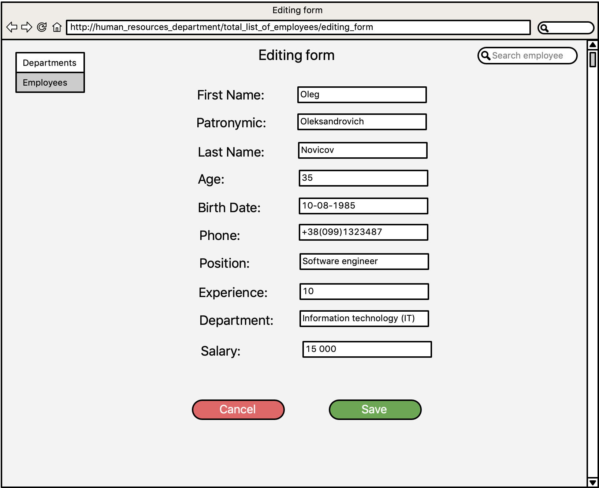
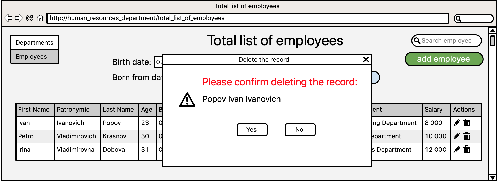
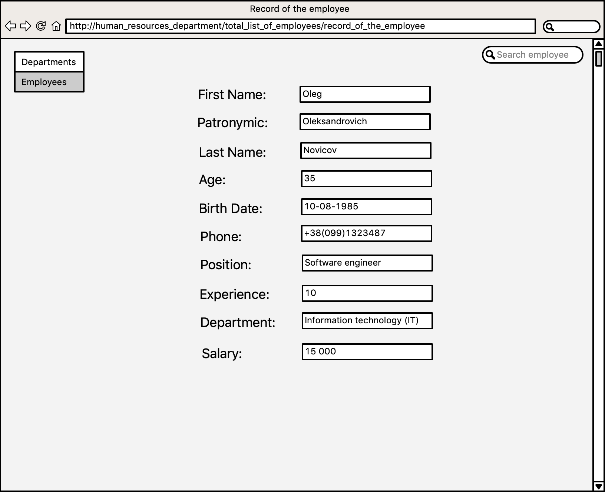
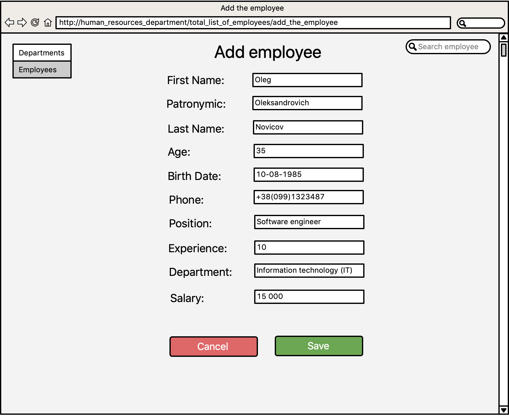

# Manager of Human Resources Department

## Vision

**«Manager of Human Resources Department»** is a web-application which allows the manager of 
Human Resources Department to record and analyze the information about every employee of 
the company and every department as a group of employees.

The application should provide:

* Storing the information of every employee and the summary information of every department as
a group of employees;
* Display the list of departments;
* Updating the information of each department (adding, editing, and removing);
* Display the total list of employees;
* Updating the information about the employee (adding, editing, and removing);
* Select the list of employees who have the same birth date;
* Select the list of employees who were born in the fixed period between dates;

## 1. Departments

### 1.1 Display the list of departments

The mode is designed to view the list of departments. According to every department 
there is displayed information about the average salary, the count of employees.

*Main scenario*:

* User selects item "Departments" in the sidebar (in the left upper corner);
* Application displays the list of departments.

* *Name* - unique name of the department;
* *Manager* - full name of the manager of the department;
* *Phone* - phone number of the department;
* *Count* of employees - total count of employees of the department;
* *Average salary* - the average salary of employees of the department;
* *Actions* - here the user can get access in order to edit the 
information about the department or to view the information about the
department.

### 1.2 Edit the information about the department

*Main scenario*:

* User clicks the left icon in the column "Actions" of the department's row;
* Application displays the form to edit the data of the department;
* User enters updated data and presses "Save" button;
* If any data is entered incorrectly, an incorrect message is displayed;
* If entered data is valid, then the updated information will be added to the database;
* If updated information was successfully added, the user will see the updated information
in *The list of departments*.

*Cancel operation scenario*:

* User clicks the left icon in the column "Actions" of the department's row;
* Application displays the form to edit the data of the department;
* User enters updated data and presses "Cancel" button;
* Updated data didn't save in database;
* The user will see the previous information in *The list of departments*;
* If the user selects the menu item "Departments", "Employees" in the sidebar (to the 
left of the editing form), the data won't be saved in the database, and the corresponding form
with updated data will be opened.

In the editing form the user can update the data of the department:
* *Name* - unique name of the department;
* *Manager* - full name of the manager of the department;
* *Phone* - phone number of the department;

### 1.3 Remove the information about the department.

*Main scenario*:

* User clicks the right icon in the column "Actions" of the department's row;
* Application displays confirmation message "Please confirm deleting the record";
* The user presses button "Yes" and confirms the removal of the department's record;
* Record is deleted from database;
* If department's record is successfully deleted, then total list of department without 
deleted record is displaying.

*Cancel operation scenario:*
* User clicks the right icon in the column "Actions" of the department's row;
* Application displays confirmation message "Please confirm removing the record";
* User press “Cancel” button;
* The total list of employees without changes is displaying.

## 2. Employees

### 2.1. Display the list of employees

The mode is designed to view and edit data about employees.

*Main scenario:*
* User selects item "Employees" in the sidebar (in the left upper corner);
* Application displays the list of employees.

The total list of employees includes the following columns:
* *First Name* - employee's first name;
* *Patronymic* - employees's patronymic;
* *Last Name* - employee's last name;
* *Age* - employee's age;
* *Birth Date* - employee's birth date;
* *Phone* - employee's phone;
* *Position* - employee's position;
* *Experience* - employee's experience;
* *Department* - employee's department;
* *Salary* - employee's salary;
* *Actions* - here the user can get access in order to edit the 
information about the employee or to remove the record about the
employee.

***Filtering by the birth date***:

* In order to view the list of employees who has the same birth date, the user enters
the birth date in the corresponding date field "Birth date" and presses the button "Search";
* Application displays the list of employees who have the same birth date;

* In order to view the list of employees who were born in the certain period, the user sets the 
date filter and presses the button "Search";
* Application displays the list of employees who were born in the certain period; 

*Restrictions:*

* If date field "Birth date" is blank, application displays the total list of employees;
* In the date entry field start date of the period should be less than end date 
of the period;

### 2.2 Edit the information about the employee

*Main scenario*:

* User clicks the left icon in the column "Actions" of the employee's row;
* Application displays the form to edit the data of the employee;
* User enters updated data and presses "Save" button;
* If any data is entered incorrectly, an incorrect message is displayed;
* If entered data is valid, then the updated information will be added to the database;
* If updated information was successfully added, the user will see the updated information in 
*"Total list of employees"*.

*Cancel operation scenario*:

* User clicks the left icon in the column "Actions" of the employee's row;
* Application displays the form to edit the data of the employee;
* User enters updated data and presses "Cancel" button;
* Updated data didn't save in database;
* The user will see the previous information of this employee in *Total list of departments*;
* If the user selects the menu item "Departments", "Employees" in the sidebar(to the 
left of the editing form), the data won't be saved in the database, and the corresponding form
with updated data will be opened.

In the editing form the user can update the data of the employee:
* *First Name* - employee's first name;
* *Patronymic* - employees's patronymic;
* *Last Name* - employee's last name;
* *Age* - employee's age;
* *Birth Date* - employee's birth date;
* *Phone* - employee's phone;
* *Position* - employee's position;
* *Experience* - employee's experience;
* *Department* - employee's department;
* *Salary* - employee's salary;

### 2.3 Remove the record of the employee.

*Main scenario:*

* User clicks the right icon in the column "Actions" of the employee's row;
* Application displays confirmation message "Please confirm deleting the record";
* The user presses button "Yes" and confirms the removal of the employee's record;
* Record is deleted from database;
* If employee's record is successfully deleted, then total list of employees without 
deleted records is displaying.

*Cancel operation scenario:*
* User clicks the right icon in the column "Actions" of the employee's row;
* Application displays confirmation message "Please confirm removing the record";
* User press “Cancel” button;
* The total list of employees without changes is displaying.

### 2.4 View the information about the employee

*Main scenario*:
* User enters the last name in the search field (in the right upper corner) and presses Enter;
* Application displays the record of the employee;

### 2.5 Add the record of the employee

*Main scenario*:
* User presses the button "Employees";
* In the page *"Total list of employees"* user presses the button "Add employee";
* Application displays the blank form of the employee;
* User enters the data in text fields and presses the button "Save";

*Cancel operation scenario*:

* User presses the button "Employees";
* In the page "Total list of employees" user presses the button "Add employee";
* Application displays the blank form of the employee;
* User enters the data in text fields and presses the button "Cancel";
* Added data didn't save in database;
* The user will see the previous list of employees in *Total list of employees*;
* If the user selects the menu item "Departments", "Employees" in the sidebar (to the 
left of the editing form), the data won't be saved in the database, and the corresponding form
with added data will be opened.

The form *"Add employee"* includes the following text fields:

* *First Name* - employee's first name;
* *Patronymic* - employees's patronymic;
* *Last Name* - employee's last name;
* *Age* - employee's age;
* *Birth Date* - employee's birth date;
* *Phone* - employee's phone;
* *Position* - employee's position;
* *Experience* - employee's experience;
* *Department* - employee's department;
* *Salary* - employee's salary;

